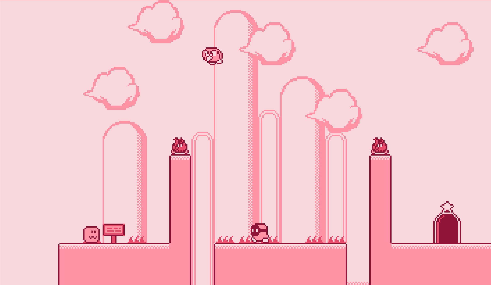

# Kirby like Platformer Game made with TypeScript + Kaboom.js

Play the game, click this link https://akashbellary.github.io/Kirby-game/

This project is done by Akash BR.
Want to know more about Me. LinkedIn: https://www.linkedin.com/in/akash-br-b86a94219/

# About the project

Kirby Game which i built here is a clone version of one of the very popular game with the same name. Kirby by Nintendo.

## Tools and Libraries Used

- **TypeScript**: For building a robust and type-safe game application.
- **Node.js**: To manage the project's dependencies and run the development server.
- **Vite**: A fast bundler and development server for modern web projects.
- **Kaboom.js**: A game development library for creating 2D games.

## How to run the project ?

Assuming you have `node` installed.

- Install dependencies with `npm install`
- Run locally with `npm run dev`
- Build for production with `npm run build` and a dist folder should appear
